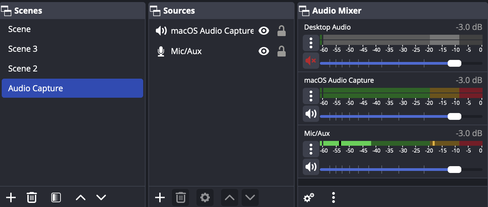
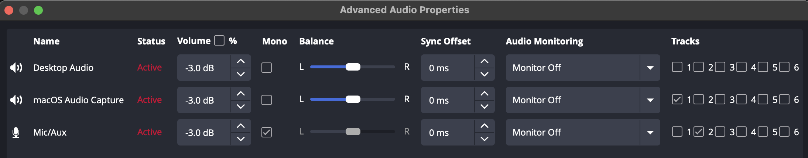
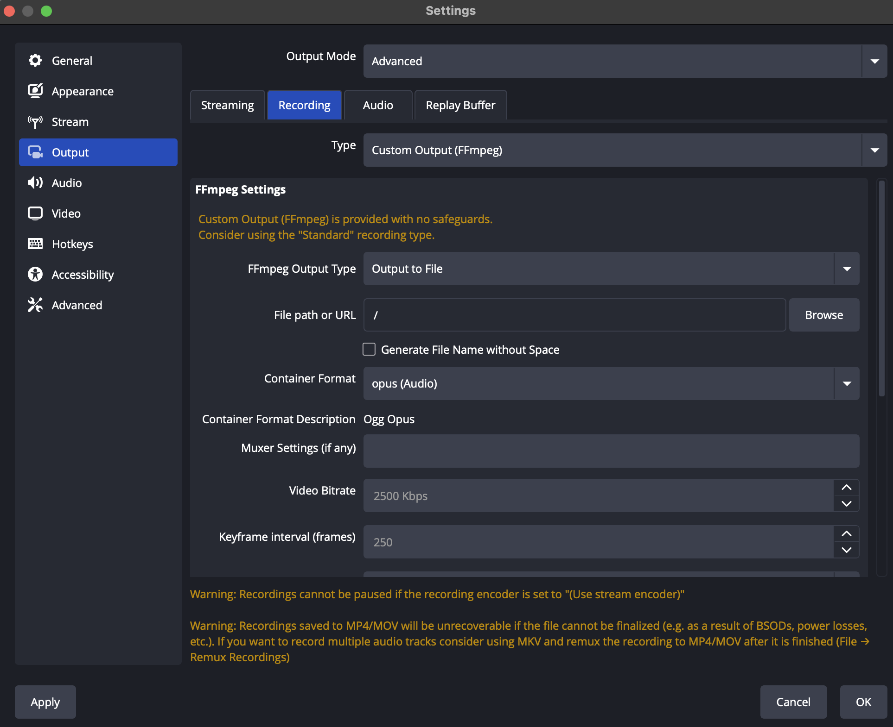
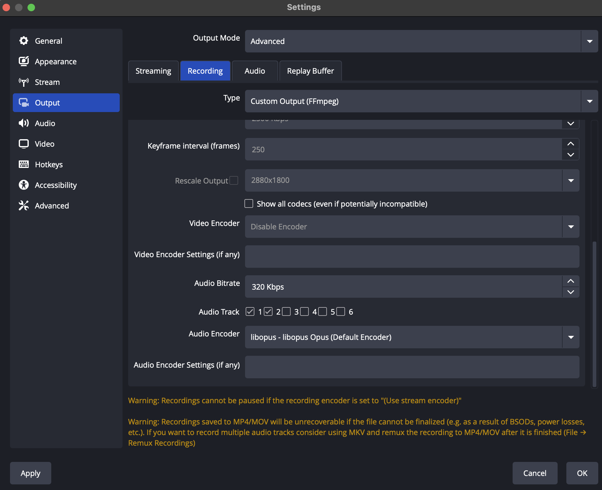

# Local OBS Audio Transcription

A Python script that transcribes multi-track audio recordings captured from OBS Studio and generates AI-powered summaries. This tool is perfect for transcribing meetings, interviews, presentations, or any audio content where you need both desktop audio and microphone input captured separately.

## Features

- **Multi-track audio separation**: Separates desktop audio and microphone tracks from OBS recordings
- **Accurate transcription**: Uses OpenAI's Whisper model for high-quality speech-to-text conversion
- **AI-powered summarization**: Generates concise summaries using Hugging Face transformers
- **Timestamped output**: Provides precise timestamps for each transcribed segment
- **Source identification**: Clearly labels audio sources (Desktop Audio vs. Microphone)

## Requirements

- Python 3.8 or higher
- FFmpeg
- OBS Studio

## Installation

1. Clone this repository:
```bash
git clone https://github.com/colinraab/local-obs-transcription.git
cd local-obs-transcription
```

2. Install Python dependencies:
```bash
pip install -r requirements.txt
```

3. Install FFmpeg:
   - **macOS**: `brew install ffmpeg`
   - **Windows**: Download from [ffmpeg.org](https://ffmpeg.org/download.html)
   - **Linux**: `sudo apt install ffmpeg` (Ubuntu/Debian) or equivalent for your distribution

4. **Set up Hugging Face authentication** (required for default Gemma model):
   
   The default summarization model (`google/gemma-3-270m-it`) requires a Hugging Face account and write token:
   
   - Create a free account at [huggingface.co](https://huggingface.co)
   - Generate a write token in your [account settings](https://huggingface.co/settings/tokens)
   - Install the Hugging Face CLI and authenticate:
   ```bash
   pip install huggingface_hub
   huggingface-cli login
   ```
   - Enter your token when prompted
   
   **Alternative**: If you prefer not to set up authentication, you can use other models that don't require tokens:
   ```bash
   # Use Qwen model (no authentication required)
   python transcribe_obs_audio.py your_recording.opus --model Qwen/Qwen3-Next-80B-A3B-Instruct

## OBS Studio Setup

### 1. Create a New Scene

First, create a new scene in OBS Studio for your recording setup:



### 2. Add Audio Sources

Add two audio input sources to capture both desktop audio and microphone:

1. **Audio Input Capture (Microphone)**:
   - Click the "+" button in Sources
   - Select "Audio Input Capture"
   - Choose your microphone device

2. **Audio Output Capture (Desktop Audio)**:
   - Click the "+" button in Sources  
   - Select "Audio Output Capture" (macOS) or "Audio Output Capture" (Windows)
   - Choose your system audio output device

### 3. Configure Advanced Audio Properties

Configure the audio tracks for proper separation:



- Set your **Microphone** to output to **Track 2** only
- Set your **Desktop Audio** to output to **Track 1** only
- Disable other tracks for these sources to ensure clean separation

### 4. Configure Output Settings

Set up your recording output settings to capture multiple audio tracks:

#### Recording Settings (Part 1):


#### Recording Settings (Part 2):


**Key settings**:
- **Recording Format**: Use the Opus format
- **Audio Track**: Enable both Track 1 and Track 2
- **Audio Encoder**: Use the libopus encoder
- **Audio Bitrate**: 320 kbps or higher for best quality

## Usage

### Basic Usage

```bash
python transcribe_obs_audio.py your_recording.opus
```

### Options

- `--no-summary`: Disable AI summarization
- `--model MODEL_NAME`: Specify a different Hugging Face model for summarization

### Examples

```bash
# Transcribe with default settings (includes summary)
python transcribe_obs_audio.py meeting_recording.mp4

# Transcribe without summary
python transcribe_obs_audio.py interview.mp4 --no-summary

# Use a different summarization model
python transcribe_obs_audio.py presentation.mp4 --model Qwen/Qwen3-Next-80B-A3B-Instruct
```

## Output

The script generates a timestamped transcription file with the following format:

```
[00:01:23 -> 00:01:28] Desktop Audio: Welcome everyone to today's meeting
[00:01:29 -> 00:01:32] Microphone: Thank you for having me
[00:01:35 -> 00:01:42] Desktop Audio: Let's start by reviewing the agenda
```

If summarization is enabled, a summary section is appended at the end:

```
====================
       SUMMARY
====================

The meeting covered project updates, budget discussions, and next steps for the quarterly review...
```

## Troubleshooting

### Common Issues

1. **FFmpeg not found**: Make sure FFmpeg is installed and available in your system PATH
2. **No audio tracks**: Ensure your OBS recording has multiple audio tracks enabled
3. **Poor transcription quality**: Try using a larger Whisper model (medium or large)
4. **Summarization errors**: Check your internet connection and Hugging Face model availability

### Model Selection

The script uses Whisper's "base" model by default, which provides a good balance of speed and accuracy. You can modify the model in the script:

- `tiny`: Fastest, lowest accuracy
- `base`: Good balance (default)
- `small`: Better accuracy, slower
- `medium`: High accuracy, much slower  
- `large`: Best accuracy, very slow

## Contributing

Contributions are welcome! Please feel free to submit a Pull Request.

## License

This project is licensed under the MIT License - see the [LICENSE](LICENSE) file for details.

## Acknowledgments

- [OpenAI Whisper](https://github.com/openai/whisper) for speech recognition
- [Hugging Face Transformers](https://huggingface.co/transformers/) for text summarization
- [FFmpeg](https://ffmpeg.org/) for audio processing
